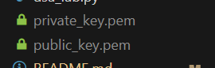
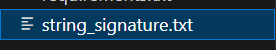
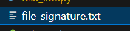

# ЗВІТ

## СТВОРЕННЯ КЛЮЧІВ
(.venv) > python dsa_lab.py genkeys                               
Секретний ключ збережено: private_key.pem
Відкритий ключ збережено: public_key.pem

## ПІДПИС СТРОКИ
(.venv) > python dsa_lab.py sign-str "текст"
SHA-1: 4b9709cf0dddb6ab990e19862eff5315073a3d80
Підпис: 0f429795cafab38359ee7bf31da9b3bc184ab3be2bf9b4b99eb380dd3061ac17d4a24b88bf36a737
Збережено у файл: string_signature.txt

## ВЕРИФІКАЦІЯ СТРОКИ
(.venv) > python dsa_lab.py verify-str "текст"
SHA-1: 4b9709cf0dddb6ab990e19862eff5315073a3d80
Підпис ДІЙСНИЙ.

## ПІДПИС ФАЙЛУ
(.venv) > python dsa_lab.py sign-file document.txt
Файл: document.txt (17 байт)
SHA-1: 8626a6158d87de235f0b45208cec73b0a8150440
Підпис: 24f2d4e89b1397f5195bfcebc196d9c493dfe6ef60320f8874389a03901f7c9995b29e3cf62e3f88
Збережено у файл: file_signature.txt

## ВЕРИФІКАЦІЯ ФАЙЛУ
(.venv) > python dsa_lab.py verify-file document.txt
Файл: document.txt (17 байт)
SHA-1: 8626a6158d87de235f0b45208cec73b0a8150440
Підпис ДІЙСНИЙ.
